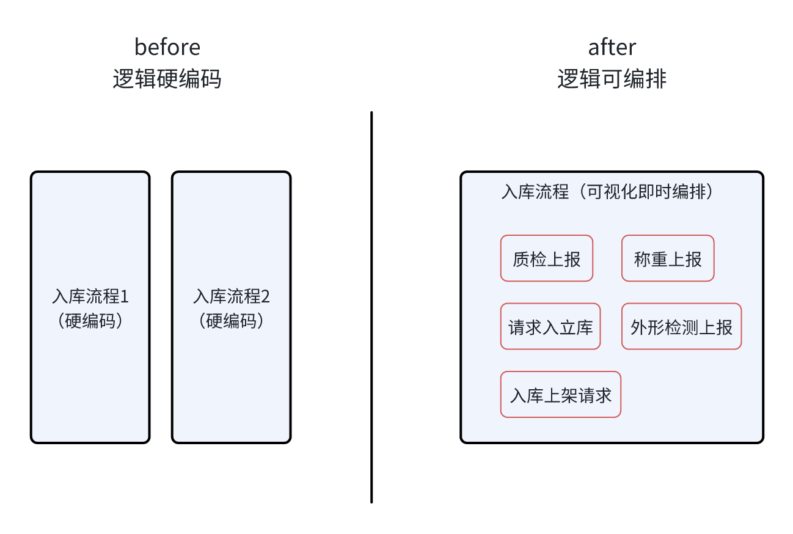
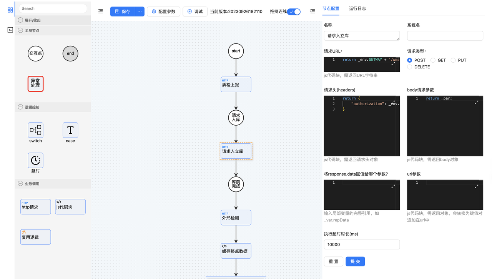
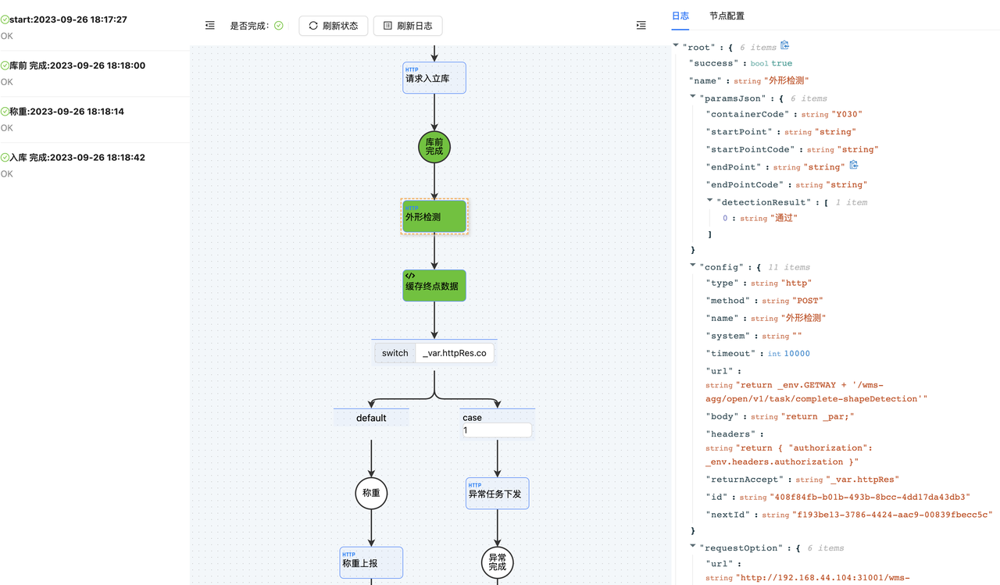

##  1. 重构前后比较

## 2. 关键产出
### 2.1 原子、聚合服务等业务资产
### 2.2 逻辑编排工具
:::tip
可视化编排
:::

:::tip
可视化调试
:::

## 3. 关键价值
### 3.1 资产沉淀
- 原子、聚合服务沉淀了常见的WMS业务，可由业务编排随时引用；
- 逻辑编排加速了业务资产沉淀的速度与广度；
### 3.2 交付提效
- 通过编排复用资产服务，可快速适配业务定制需求；
- 对于业务流程变更，可通过逻辑编排快速交付，不用修改代码；
### 3.3 解资源瓶颈
- 通过可视化编排，可降低业务开发对于后端人员的依赖，实习生、前端开发也可以调整、开发业务逻辑；
### 3.4 降低变更影响
- 传统开发变更，需要重新发布整个服务，其中包括很多API接口，影响面较广，通常会造成生产中断，而逻辑编排与API接口一一对应，可实现API级别的变更与部署，大大降低变更影响范围，不易造成生产中断。